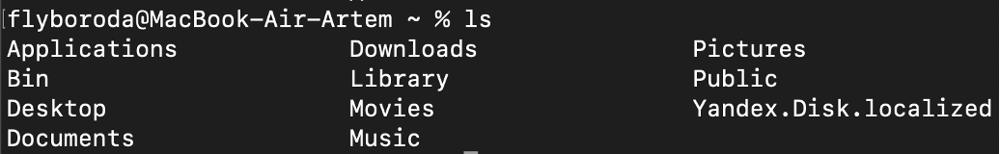
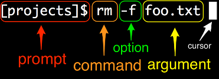
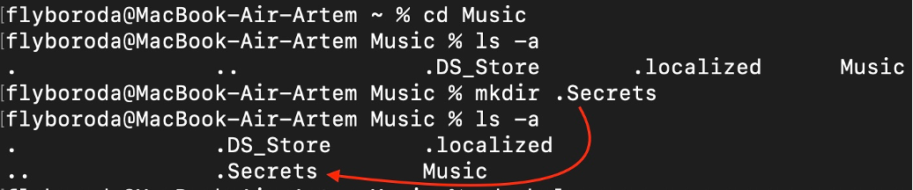
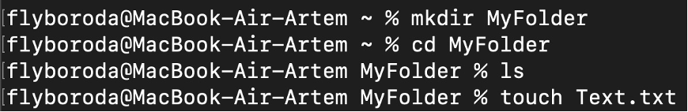
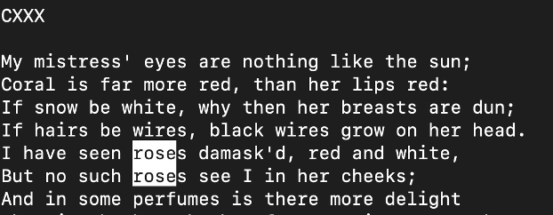
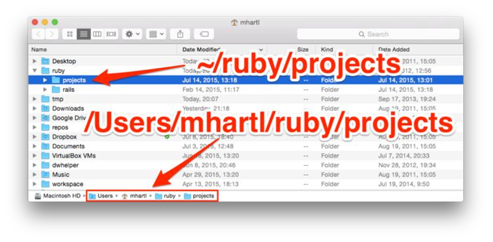

# The Command Line and Terminal

## <a id="contents" />Оглавление

[Using Z Shell or Bash on Macs](#chapter1)

[Redirecting and appending](#chapter2)

[Listing](#chapter3)

[Hidden files](#chapter4)

[Renaming, copying, deleting](#chapter5)

[Inspecting files](#chapter6)

[Количество строк/слов/байтов](#chapter7)

[Less is more](#chapter8)

[Grepping](#chapter9)

[Directories](#chapter10)

[Making directories](#chapter11)

[Navigating directories](#chapter12)

[Renaming, copying, and deleting directories](#chapter13)

[Grep redux](#chapter14)

---
### Часто используемые команды в терминале Mac

### Горячие клавиши

| Команда | Описание |
| ----------- | ----------- |
| Ctrl + A   | Переместиться в начало набранной строки.  Это также работает практически для всех полей ввода в системе, за исключением IDE Netbeans.|
| Ctrl + E   | Переместиться в конец выбранной строки.  Это также работает практически для всех полей ввода в системе, за исключением IDE Netbeans. |
| Ctrl + Q   | Очистить текущую строку |
| Ctrl + L   | Очистить экран |
| Cmd + K    | Очистить экран |
| Ctrl + U   | Вырезать все символы с начала строки и до текущего положения курсора |
| Ctrl + K   | Вырезать все символы, начиная от текущего положения курсора и до конца строки |
| Ctrl + W   | Вырезать одно слово слева до первого пробела |
| Ctrl + Y   | Вставить то, что было вырезано последней командой "Вырезать" |
| Ctrl + H   | То же самое, что клавиша Backspace |
| Ctrl + C   | Прервать исполнение запущенной программы |
| Ctrl + D   | Выход из консоли если в консоли нет запущенных процессов или послать EOF запущенному процессу |
| Ctrl + Z   | Переместить запущенный процесс в фоновый процесс и приостановить его. Команда `fg` восстанавливает прежнее состояние процесса. |
| Ctrl + _   | Отменить последнюю выполненную команду. (Это знак подчеркивания, т.е. Ctrl + Shift + minus) |
| Ctrl + T   | Поменять местами символ справа от курсора с символом слева от курсора. Если курсор находится в конце строки, то поменять последние два символа местами.|
| Ctrl + F   | Переместить курсор на один символ вперед |
| Ctrl + B   | Переместить курсор на один символ назад |
| Option + →  | Переместить курсор на одно слово вперед |
| Option + ←  | Переместить курсор на одно слово назад |
| Esc + T  | Поменять местами слово слева от курсора со словом справа от курсора. Если курсор стоит в конце строки, то поменять последние два слова местами.|
| Tab  | Автодополнение строки именами файлов или папок, которые совпадают с началом строки |

## КЛЮЧЕВЫЕ КОМАНДЫ

| Команда | Описание |
| ----------- | ----------- |
| cd [folder] | Сменить директорию. Например `cd Documents` |
| cd |  Переместиться в домашнюю директорию |
| cd ~ |  Переместиться в домашнюю директорию |
| cd /  | Переместиться в корневую папку диска |
| cd -  | Переместиться в предыдущую директорию |
| ls | Список файлов и папок в текущей директории |
| ls -l | Список файлов и папок в текущей директории. Название каждого файла/папки печатается на отдельно строке |
| ls -a | Список файлов и папок в текущей директории с учётом скрытых файлов и папок|
| ls -lh| Список файлов и папок с размером объектов в Кб, Мб и т.д. |
| ls -R | Отобразить рекурсивно список всех файлов и папок в директории |
| sudo [command] | Выполнить команду с правами суперпользователя (Super User DO) |
| open [file] | Открыть файл (равносильно открытию файла двойным щелчком мыши) |
| top | Отобразить активные процессы. Нажмите `q` для выхода |
| nano [file] | Открыть файл в редакторе `nano` |
| vim [file] | Открыть файл в редакторе `vim` |
| clear |  Очистить экран |
| reset |  Сбросить дисплей терминала |

## ОБЪЕДИНЕНИЕ КОМАНД В ЦЕПОЧКИ

| Команда | Описание |
| ----------- | ----------- |
| [command-a]; [command-b] | Выполнить команду `a`, а затем выполнить команду `b` независимо от результата выполнения команды `a`|
| [command-a] && [command-b] | Выполнить команду `b` только если команда `a` выполнилась успешно|
| [command-a] &#124;&#124; [command-b] | Выполнить команду `b` только если команда `a` выполнилась с ошибкой |
| [command-a] & | Выполнить команду `a` в фоновом режиме|


## ПЕРЕДАЧА РЕЗУЛЬТАТОВ ОДНОЙ КОМАНДЫ ДРУГОЙ КОМАНДЕ

| Команда | Описание |
| ----------- | ----------- |
| [command-a] \| [command-b] | Выполнить команду `a` и передать результат выполнения команде `b`. Например `ps auxwww \| grep google` |


## ИСТОРИЯ КОМАНД

| Команда | Описание |
| ----------- | ----------- |
| history n |  Показать последние набранные команды. Добавьте вместо `n` число чтобы ограничить количество команд |
| Ctrl + r  | Интерактивные поиск среди последних набранных команд |
| ![value] |  Выполнить последнюю набранную команду, которая начинается c ‘value’ |
| !! |  Выполнить последнюю набранную команду |

## РАБОТА С ФАЙЛАМИ

| Команда | Описание |
| ----------- | ----------- |
| touch [file] |   Создать новый файл |
| pwd | Отобразить полный путь текущей директории |
| . |  Текущая директория. Например `ls .` |
| .. | Родительская директория, Например `ls ..` |
| ls -l .. | Список всех файлов директорий, которые находятся на том же уровне что и родительская директория |
| cd ../../ | Переместиться на 2 уровня вверх |
| cat | Объединение и печать содержимого файлов |
| rm [file] |  Удалить файл. Например `rm data.tmp` |
| rm -i [file] | Удалить файл с подтверждением |
| rm -r [dir] | Удалить директорию и её содержимое |
| rm -f [file] | Удалить файл без подтверждения |
| cp [file] [newfile] | Копировать файл в другой файл |
| cp [file] [dir] | Копировать файл в директорию |
| mv [file] [new filename] |  Переместить/Переименовать файл. Например `mv file1.ad /tmp` |
| pbcopy < [file] | Копировать содержимое файла в буфер обмена |
| pbpaste | Вставить содержимое из буфера обмена |
| pbpaste > [file] | Вставить содержимое из буфера обмена в файл. Например `pbpaste > paste-test.txt` |

## РАБОТА С ДИРЕКТОРИЯМИ

| Команда | Описание |
| ----------- | ----------- |
| mkdir [dir] | Создать директорию |
| mkdir -p [dir]/[dir] |  Создать директорию и вложенную директорию |
| rmdir [dir] | Удалить директорию (работает только с пустыми директориями) |
| rm -R [dir] | Удалить директорию и содержимое |
| less [file]|  Вывести содержимое файла на экран. Прервать вывод если он не вмещается на экран. Можно продолжить вывод нажав `Space`  |
| [command] > [file] |  Поместить результат выполнения команды в файл. Существующий файл будет переписан с нуля |
| [command] >> [file] | Поместить результат выполнения команды в файл. Существующий файл будет дополнен |
| [command] < [file] |  Передать содержимое файла на вход команде |

## ПОИСК

| Команда | Описание |
| ----------- | ----------- |
| find [dir] -name [search_pattern] | Искать файлы в заданной директории. Например `find /Users -name "file.txt"` |
| grep [search_pattern] [file] | Искать строки в файле, которые подпадают под шаблон. Например `grep "Tom" file.txt` |
| grep -r [search_pattern] [dir] | Рекурсивно искать строки в файлах в заданной директории, которые подпадают под шаблон. |
| grep -v [search_pattern] [file] | Искать строки в файле, которые НЕ подпадают под шаблон |
| grep -i [search_pattern] [file] | Искать строки в файле, которые подпадают под шаблон с учётом регистра |
| mdfind [search_pattern] | Искать при помощи `Spotlight` (название, содержимое, другие данные). Например `mdfind skateboard` |
| mdfind -onlyin [dir] -name [pattern] | Искать при помощи `Spotlight` в заданной директории |

## ПОМОЩЬ

| Команда | Описание |
| ----------- | ----------- |
| [command] -h |  Вывод справки по команде|
| [command] --help | Вывод справки по команде |
| info [command] | Вывод справки по команде |
| man [command] |  Вывод руководства пользователя по команде [command] |
| whatis [command] | Вывод описания команды или команд подпадающих под шаблон [command] |
| apropos [search-pattern] | Поиск по базе данных команд по шаблону |

***BASH*** – название является аббревиатурой от «Bourne-again shell», отсылкой к более ранней оболочке Bourne и каламбуром термина «рожденный заново», самый популярный командный интерпретатор в юниксоподобных системах, в особенности в GNU/Linux.   
Bash можно установить с помощью инструмента управления пакетами, такого как Homebrew

- [Использование оболочки zsh в качестве стандартной оболочки на компьютере Mac ](https://support.apple.com/ru-ru/HT208050)

- [Ресурс по #zsh](https://wiki.archlinux.org/title/Zsh_(%D0%A0%D1%83%D1%81%D1%81%D0%BA%D0%B8%D0%B9))

---
---
[К оглавлению](#contents)
## <a id="chapter1" />Using Z Shell or Bash on Macs
 https://news.learnenough.com/macos-bash-zshell 

Как сменить оболочки с `zsh` on `bash`? How to change shells
The main technique is to use the chsh program, which stands for “change shell”. Note that this procedure is entirely reversible (as described below), so there is no need to be concerned about damaging your system.
The first step is to confirm the identity of your current shell program using the echo command

```bash
$ echo $SHELL
/bin/bash
```
This prints out the `$SHELL` environment variable, which in most cases prints out the value of the current shell—in this case, Bash. (In rare cases, `$SHELL` may differ from the current shell, but the procedure below will still correctly change from one shell to another.) To change to `Zsh`, simply follow Apple’s suggestion from Listing 1 and run chsh (“change shell”) with the ` -s ` (“newshell”) option:

```bash
$ chsh -s /bin/zsh
```
You’ll almost certainly be prompted to type your system password at this point, which you should do. Then completely exit your shell program using **Command-Q** and relaunch it.
Once you’ve followed the steps above, you’ll be running Z shell instead of Bash, as you can confirm with echo:

```bash
$ echo $SHELL
/bin/zsh
```
If you ever want to switch back, simply use the same `chsh` command with bash in place of zsh:

```bash
$ chsh -s /bin/bash
```
As with the previous case, type in your password and then restart your terminal program. The result will be a restoration of your previous settings:

```bash
$ echo $SHELL
/bin/bash
```

---
### Отличия оболочек
Более существенное отличие связано с поведением по умолчанию. Системы Bash обычно называют потенциально опасные команды `rm` (удалить), `mv` (переместить) и `cp` (копировать) версиями, использующими параметр `-i`, который требует подтверждения для любых возможных удалений:
При удалении требуется подтверждение

#### Bash example.

```bash
$ touch foo
$ rm foo
remove foo? n
$ ls foo
foo
```

`rm` alone is sufficient. Его можно переопределить с помощью `-f` (force) option:

#### Bash example continued.

```bash
$ rm -f foo
$ ls foo
ls: foo: No such file or directory
```

The same patterns apply to the wildcard operator ` * `:

#### Bash example.

```bash
$ touch foo.baz
$ touch bar.baz
$ rm *.baz
remove bar.baz? n
remove foo.baz? n
$ rm -f *.baz
$ ls *.baz
ls: *.baz: No such file or directory
```

Для использования таких команд в zsh нужно внести изменения
To ensure that this behavior is the same in Zsh, two changes are needed. First, we need to add the corresponding aliases, which fortunately follow the same syntax as Bash 

#### Avoid accidental deletions

```bash
alias rm='rm -i'
alias mv='mv -i'
alias cp='cp -i'
```
[Подробнее в статье есть гайды](https://news.learnenough.com/macos-bash-zshell)

---
[Learn Enough Command Line to Be Dangerous](https://www.learnenough.com/command-line-tutorial/basics) 

Графический интерфейс пользователя (GUI) может значительно упростить использование компьютера, но во многих случаях наиболее мощным и гибким способом взаимодействия с компьютером является интерфейс командной строки (CLI).
Возможно нужно будет поставить [iTerm2](https://iterm2.com/features.html)  

Тильда ` ~ ` указывает на домашний каталог, в котором вы находитесь.
Забавно, что причина, по которой символ тильды используется для домашнего каталога, заключается просто в том, что клавиша “Home” была такой же, как клавиша для создания `~` на некоторых ранних клавиатурах

 </img> 

The **prompt** (to “prompt – побудить к действию, подсказка” the user to do something) followed by a **command** (as in “give the computer a command”), an **option** (as in “choose a different option”), and an **argument** (as in the “argument of a function” in mathematics).  prompt выдается терминалом автоматически, и вам не нужно его набирать

 </img> 

---
Каждая командная строка начинается с некоторого символа или символов, призванных «побудить – prompt» вас к действию. Запрос обычно заканчивается знаком доллара `$` или знаком процента `%`, и ему предшествует информация, которая зависит от особенностей вашей системы.

Новая вкладка tab -> `command + T`

Новое окно `command + N`

Команда `echo [Печать текста]`, похожа на `print()`

```bash
$ echo hello, goodbye
hello, goodbye
$ echo "hello, goodbye"
hello, goodbye
```

Чтобы выбрать предыдущую введенную команду и выбирать из них используем стрелочки `вверх` и `вниз` 

Если компанда длинная и нам нужно что-то отредактировать в ней, мы можем двигать курсор ввода стрелочками вправо/влево, или зажать `Alt/Option` и явно кликнуть на нужное место курсором. Или использовать клавиатуру и ввести команду `Control + A` возвращающую курсор в начало строки и команду `Control + E` возвращающую курсор в конец строки

Команда `Control + U` очистит введенную команду без ее выполнения

Команда `clear` or `control + L` очищает весь экран терминала 
Команда `exit` or `control + D` команда выхода, окончания компиляции

Если мы ввели неверно команду, или терминал завис, нажимаем `control + C` или `ctrl + C` или `ESC (escape)`. Вот примеры, когда терминал зависнет (команды с ошибками или пустые)

```bash
$ echo "hello
$ grep foobar
$ yes
$ tail
$ cat
```

Чтобы узнать больше информации о команде `man [command name]`
Чтобы выйти из справочного окна нажимаем клавишу `q`

```bash
$ man echo
```

Команда `man man` даем инфо о самой команде
```bash
$ man man
man(1)                                 man(1)
NAME
    man - format and display the on-line manual pages
```

Можно разделить строку с помощью символа `\n`

Команда сон `sleep [seconds]`

---
[К оглавлению](#contents)
## <a id="chapter2" />Redirecting and appending
Our task now is to create a file containing this line, it is possible to do this using the redirect operator ` > `

```bash
$ echo "From fairest creatures we desire increase," > sonnet_1.txt
```

Команда `cat [Name file]` выводит содержимое файла на экран:

```bash
$ cat sonnet_1.txt
From fairest creatures we desire increase,
```
Название `cat` является сокращением от `concatenate`, что является намеком на то, что его можно использовать для объединения содержимого нескольких файлов, но использование выше, как для вывода содержимого одного файла на экран чрезвычайно распространено. Думайте о `cat` как о «быстром и грязном» способе просмотра содержимого определенного файла

Чтобы добавить строку мы можем использовать оператор добавления append operator ` >> ` следующим образом

```bash
$ echo "That thereby beauty's Rose might never die," >> sonnet_1.txt
```

---
Чтобы облегчить сравнение похожих, но не идентичных файлов, есть команда `diff`.

Она часто используется как: «Какая разница между этими файлами?», и «Вы должны сравнить файлы, чтобы увидеть, что изменилось». Когда между двумя файлами нет различий, `diff` просто ничего не выводит

```bash
$ diff sonnet_1.txt sonnet_1_lower_case.txt
< That thereby beauty's Rose might never die,
---
> That thereby beauty's rose might never die,
```

Можно содержимое одного файла добавить в другой файл, добавится вниз

```bash
flyboroda@MacBook-Air-Artem Swift learn % cat sonnet_1.txt
  From fairest creatures we desire increase,
  That thereby beauty's Rose might never die,
flyboroda@MacBook-Air-Artem Swift learn % cat sonnet_1.txt >> sonnet_1_lower_case.txt
flyboroda@MacBook-Air-Artem Swift learn % cat sonnet_1_lower_case.txt 
  From fairest creatures we desire increase,
  That thereby beauty's rose might never die,
   From fairest creatures we desire increase,
   That thereby beauty's Rose might never die,
```

Можно содержание двух файлов объединить и добавить в новый  файл `sonnet1.txt` . Команда `cat` может принимать несколько аргументов

```bash
flyboroda@MacBook-Air-Artem Swift learn % cat sonnet_1.txt sonnet_1_lower_case.txt >> sonnet1.txt
```

---
[К оглавлению](#contents)
## <a id="chapter3" />Listing
Команда `ls` просто выводит список всех файлов и каталогов в текущей директории

`ls -a` Список файлов и папок в текущей директории с учётом скрытых файлов и папок

 </img>

Одной из полезных возможностей `ls` является поддержка подстановочного знака ` * `. Например, чтобы перечислить все файлы, оканчивающиеся на `.txt`

Автоматически заменяется на все имена файлов, которые соответствуют шаблону `любая строка, за которой следует .txt`

```bash
flyboroda@MacBook-Air-Artem zsh % ls *.txt
Plan.txt		sonnet_1.txt
sonnet1.txt		sonnet_1_lower_case.txt
```

В длинной форме `ls -l [name file]` or `ls -l *[name format]`  указаны дата и время, указывающие время последнего изменения файла. Число перед датой – это размер файла в байтах

```bash
flyboroda@MacBook-Air-Artem zsh % ls -l  *.txt
-rw-r--r--@ 1 flyboroda  staff  816 27 дек 12:23 Plan.txt
-rw-r--r--@ 1 flyboroda  staff  348 15 янв 13:29 sonnet1.txt
-rw-r--r--@ 1 flyboroda  staff   87 15 янв 12:58 sonnet_1.txt
-rw-r--r--@ 1 flyboroda  staff  261 15 янв 13:12 sonnet_1_lower_case.txt
flyboroda@MacBook-Air-Artem zsh % ls -l Plan.txt
-rw-r--r--@ 1 flyboroda  staff  816 27 дек 12:23 Plan.txt

flyboroda@MacBook-Air-Artem zsh % ls -l sonnet* 
-rw-r--r--@ 1 flyboroda  staff  348 15 янв 13:29 sonnet1.txt
-rw-r--r--@ 1 flyboroda  staff   87 15 янв 12:58 sonnet_1.txt
-rw-r--r--@ 1 flyboroda  staff  261 15 янв 13:12 sonnet_1_lower_case.txt

flyboroda@MacBook-Air-Artem zsh % ls -l s*
-rw-r--r--@ 1 flyboroda  staff  348 15 янв 13:29 sonnet1.txt
-rw-r--r--@ 1 flyboroda  staff   87 15 янв 12:58 sonnet_1.txt
-rw-r--r--@ 1 flyboroda  staff  261 15 янв 13:12 sonnet_1_lower_case.txt
```

`ls -rtl` «список по обратному времени модификации (длинный формат)», который перечисляет длинную форму каждого файла или каталога в порядке того, как недавно они были изменены (обратно, так что самые последние измененные записи появляются в нижней части экрана для удобства просмотра).
Кроме того, их порядок не имеет значения, поэтому ввод `ls -trl` дает тот же результат. Можно и так `-r -t -l`

```bash
flyboroda@MacBook-Air-Artem zsh % ls -rtl
total 32
-rw-r--r--@ 1 flyboroda  staff  816 27 дек 12:23 Plan.txt
-rw-r--r--@ 1 flyboroda  staff   87 15 янв 12:58 sonnet_1.txt
-rw-r--r--@ 1 flyboroda  staff  261 15 янв 13:12 sonnet_1_lower_case.txt
-rw-r--r--@ 1 flyboroda  staff  348 15 янв 13:29 sonnet1.txt
-rw-r--r--  1 flyboroda  staff    0 15 янв 14:31 foo
flyboroda@MacBook-Air-Artem zsh % ls -r -l -t Plan.txt 
-rw-r--r--@ 1 flyboroda  staff  816 27 дек 12:23 Plan.txt
```

Создадим новую папку и в ней файл Text.txt
`mkdir .Secrets` Создать скрытую директорию
`mkdir Secrets` Создать директорию
Команда для создания файла `touch [Name file]`
 </img>

---
[К оглавлению](#contents)
## <a id="chapter4" />Hidden files
Hidden files (and directories), which don’t show up by default when listing files. Hidden files and directories are identified by starting with a dot  ` . `  
Создадим файл с именем  `.gitignore`, который сообщает определенной программе (Git) игнорировать файлы, соответствующие определенным шаблонам. В качестве конкретного примера, чтобы игнорировать все файлы, оканчивающиеся на `.txt`, мы могли бы сделать это:

```bash
$ echo "*.txt" > .gitignore
$ cat .gitignore
*.txt
```

If we then run ls, the file won’t show up, because it’s hidden:

```bash
$ ls
sonnet_1.txt
sonnet_1_reversed.txt
```
To get ls to display hidden files and directories, we need to pass it the ` -a ` option (for “all”):

```bash
$ ls -a
.           .gitignore      sonnet_1_reversed.txt
..          sonnet_1.txt
Now .gitignore shows up, as expected.
```

Выведем все файлы, в том числе скрытые, по времени изменения с информацией

```bash
flyboroda@MacBook-Air-Artem zsh % ls -rtl -a
total 40
-rw-r--r--@  1 flyboroda  staff  816 27 дек 12:23 Plan.txt
-rw-r--r--@  1 flyboroda  staff   87 15 янв 12:58 sonnet_1.txt
-rw-r--r--@  1 flyboroda  staff  261 15 янв 13:12 sonnet_1_lower_case.txt
-rw-r--r--@  1 flyboroda  staff  348 15 янв 13:29 sonnet1.txt
-rw-r--r--   1 flyboroda  staff    0 15 янв 14:31 foo
drwxr-xr-x@ 17 flyboroda  staff  544 15 янв 14:32 ..
drwxr-xr-x@  8 flyboroda  staff  256 16 янв 21:32 .
-rw-r--r--   1 flyboroda  staff    7 16 янв 21:32 .gitignore
```

---
[К оглавлению](#contents)
## <a id="chapter5" />Renaming, copying, deleting
The way to rename a file is with the `mv` command, short for “move”:

```bash
$ echo "test text" > test.txt
$ mv test.txt test_file.txt
$ ls
test_file.txt
```

The way to copy a file is with `cp`, short for “copy”, первый идет источник копирования, затем новый файл который будет создан путем копирования исходного

```bash
$ cp test_file.txt second_test.txt
$ ls
second_test.txt
test_file.txt
```

Finally, the command for deleting a file is `rm`, for “remove”:

```bash
$ rm second_test.txt
remove second_test.txt? y
$ ls second_test.txt
ls: second_test.txt: No such file or directory
```

Удалить файл (remove) rm second_test.txt удалится, минуя корзину
For example, to remove all the files ending with `.txt` using a single command, without having to confirm each one, you can type this:
Удалить все файлы в папке ` rm * `

```bash
$ rm *
```

Here ` -f ` (for “force”) overrides the implicit `-i` option and removes all files immediately

```bash
$ rm -f *.txt
```

Или удалить лишь выборочно по выборке имени с помощью `*`

```bash
flyboroda@MacBook-Air-Artem MyFolder % ls
Plan.txt		one.txt			sonnet_1_lower_case.txt
foo			sonnet1.txt		two.txt
flyboroda@MacBook-Air-Artem MyFolder % rm sonnet*
flyboroda@MacBook-Air-Artem MyFolder % ls
Plan.txt	foo		one.txt		two.txt
```

Можно удалить всю папку, для этого есть другая команда `rm -r [Name folder]`

Объединив команду `cat` и оператор перенаправления ` > `, создайте копию foo.txt c именем baz.txt без использования команды `cp`.

```bash
flyboroda@MacBook-Air-Artem MyFolder % cat foo.txt > baz.txt
flyboroda@MacBook-Air-Artem MyFolder % ls
Plan.txt	baz.txt		foo.txt		two.txt
bar.txt		foo		one.txt
flyboroda@MacBook-Air-Artem MyFolder % cat baz.txt
hello, world
```

Создайте файл c названием quux.txt включающий содержимое foo.txt за которым следует содержание bar.txt 

```bash
flyboroda@MacBook-Air-Artem MyFolder % cat foo.txt baz.txt > quux.txt
flyboroda@MacBook-Air-Artem MyFolder % cat quux.txt 
hello, world
hello, world
```

---
[К оглавлению](#contents)
## <a id="chapter6" />Inspecting (просмотр) files 
Мы можем загрузить файл из Интернета с помощью мощной утилиты `curl`, которая позволяет нам взаимодействовать с URL-адресами в командной строке. Команда `curl` широко доступна в системах Unix. Чтобы убедиться, что она доступна в вашей системе, мы можем использовать команду `which`, которая проверяет, доступна ли данная программа в командной строке. 

Способ его использования состоит в том, чтобы ввести, за `which` следует название программы — в данном случае `curl`:

```bash
flyboroda@MacBook-Air-Artem Swift learn % which curl
/usr/bin/curl
```
Технически, `which` определяет местоположение файла по пути пользователя, который представляет собой список каталогов, в которых расположены исполняемые программы.
Я показал вывод в своей системе, но результат в вашей системе может отличаться. В частности, если результатом будет просто пустая строка, вам придется установить `curl`, что вы можете сделать, набрав в Google установить `curl`, за которым следует название вашей операционной системы. После установки `curl` мы можем загрузить файл, содержащий большой объем текста и тп. C помощью `curl` + опция `-OL` содержит заглавную букву “O” (O), а не ноль (0)
Например:

```bash
flyboroda@MacBook-Air-Artem Swift learn % curl -OL https://oit.ua.edu/wp-content/uploads/2020/12/Linux_bash_cheat_sheet-1.pdf
```

Чтобы повторить предыдущую выполненную команду вводим ` !! `

```bash
flyboroda@MacBook-Air-Artem MyFolder % !!
```

` ! [name command] ` которое запускает последнюю команду, которая начиналась с этих символов. Например, чтобы выполнить последнюю команду `curl`, мы могли бы ввести следующее:

```bash
flyboroda@MacBook-Air-Artem MyFolder % !curl
```
или даже не полное имя команды

```bash
flyboroda@MacBook-Air-Artem MyFolder % !c
```
Второй и невероятно мощный метод – это `Ctrl-R`, который позволяет вам выполнять интерактивный поиск по вашим предыдущим командам, а затем при необходимости редактировать результат перед выполнением. 

```bash
flyboroda@MacBook-Air-Artem MyFolder % ls    
bck-i-search: ls_
```

Количество байтов в предыдущем упражнении достаточно велико, поэтому его более естественно рассматривать в килобайтах (часто рассматривается как 1000 байт, но на самом деле равно 210 = 1024 байта). Используя опцию `-h` (“читаемый человеком”) для `ls`, перечислите длинную форму файла sonnets с количеством байтов, читаемых человеком.

```bash
flyboroda@MacBook-Air-Artem MyFolder % ls -rtlh     
total 856
-rw-r--r--  1 flyboroda  staff   267K 18 янв 23:06 Linux_bash_cheat_sheet-1.pdf
```

Двумя дополнительными командами для проверки файлов являются `head` и `tail`, которые позволяют нам просматривать начало и конец файла. 
Команда `head` показывает первые 10 строк файла

```bash
flyboroda@MacBook-Air-Artem MyFolder % head sonnets.txt
```
Команда `tail` показывает последние 10 строк файла

```bash
flyboroda@MacBook-Air-Artem MyFolder % tail sonnets.txt
```
Эти две команды полезны, когда вы точно знаете, что вам нужно проверить только начало или конец файла.

---
[К оглавлению](#contents)
## <a id="chapter7" />Количество строк/слов/байтов
Команда `wc` (сокращение от “количество слов). Наиболее часто `wc` используется для полных файлов. Например, мы можем запустить `sonnets.txt` через `wc`:

```bash
flyboroda@MacBook-Air-Artem MyFolder % wc sonnets.txt 
    2620   17670   95635 sonnets.txt
```
Здесь три числа указывают, сколько строк, слов и байтов содержится в файле, таким образом, в нем 2620 строк, 17670 слов и 95635 байт. Мы можем объединить c `head`

```bash
$ head sonnets.txt > sonnets_head.txt
$ wc sonnets_head.txt
   10   46   294 sonnets_head.txt
```

С другой стороны, у вас может возникнуть ощущение, что создавать промежуточный файл только для запуска на нем `wc` излишне, и действительно, есть способ избежать этого, используя технику, называемую `pipes` суть в использовании знака `| ` прямой линии

```bash
flyboroda@MacBook-Air-Artem MyFolder % tail sonnets.txt | wc
      10      77     425
```
Команда выполняет команду `tail sonnets.txt` а затем передает результат через `wc`, используя `pipe symbol | ` (***Shift-backslash on QWERTY key-boards***). Причина, по которой это работает, заключается в том, что команда `wc`, помимо того, что принимает имя файла в качестве аргумента, может (как и многие программы Unix) принимать входные данные из “стандартного ввода”, который в данном случае является выводом заголовка `sonnets.txt`. Программа `wc` принимает эти входные данные и подсчитывает их так же, как подсчитывает файл, получая то же количество строк, слов и байтов

Можно отображать выборочное количество строк благодаря опции `head` or `tail` + `-n<count>`

```bash
flyboroda@MacBook-Air-Artem MyFolder % head -n1 newfile1.txt 
Hello, World
flyboroda@MacBook-Air-Artem MyFolder % head -n2 newfile1.txt 
Hello, World
Hello, Instagram
```

---
[К оглавлению](#contents)
## <a id="chapter8" />Less is more 
Unix предоставляет две утилиты для обычного случая, когда требуется просмотреть больше, чем просто начало или конец файла. Более старая из этих программ называется `more`, есть более мощный вариант под названием `less`. Программа `less` интерактивна, поэтому ее трудно запечатлеть в печати, но вот примерно, как она выглядит:

```bash
flyboroda@MacBook-Air-Artem MyFolder % less sonnets.txt
flyboroda@MacBook-Air-Artem MyFolder % more sonnets.txt
```
В некоторых системах, по-видимому, это одна и та же программа.
Суть `less` в том, что онa позволяет перемещаться по файлу несколькими полезными способами, такими как перемещение на одну строку вверх или вниз с помощью клавиш со стрелками, нажатие пробела для перемещения страницы вниз, нажатие `Ctrl-F` для перемещения страницы вперед (т.e. тот же пробел) или `Ctrl-B` для перемещения страницы назад. Чтобы выйти из режима команды введите ` q `.

Возможно, самым мощным аспектом `less` является клавиша прямой косой черты ` / `, которая позволяет выполнять поиск по файлу от начала до конца. Например, предположим, что мы хотим выполнить поиск по `sonnets.txt` для “розы” . Введем `/rose` в самом режиме просмотра

 </img> 

Результатом нажатия кнопки `return` после ввода `/rose` является выделение первого вхождения “rose” в файле. Затем вы можете нажать `n`, чтобы перейти к следующему найденному фрагменту, или `Shift + N`, чтобы перейти к предыдущему найденному фрагменту.

Последние две основные команды `less` – это `G` для перехода к началу файла и `Shift + G` для возврата к концу.

---
[К оглавлению](#contents)
## <a id="chapter9" />Grepping (захватывающий)
Одним из самых мощных инструментов для проверки содержимого файлов является `grep`

Наиболее распространенное использование `grep` – это просто поиск подстроки в файле. Например, как использовать `less` для поиска строки “rose” в файле `sonnets.txt`. Используя `grep`, мы можем найти ссылки напрямую

```bash
flyboroda@MacBook-Air-Artem MyFolder % grep rose sonnets.txt 
The rose looks fair, but fairer we it deem
As the perfumed tincture of the roses.
Die to themselves. Sweet roses do not so;
```
С помощью команды `wc`, мы можем подсчитать количество строк, содержащих ссылки на слово “rose”

```bash
flyboroda@MacBook-Air-Artem MyFolder % grep rose sonnets.txt | wc
      10      82     419
```

`grep` по умолчанию чувствителен к регистру, а “rose” не совпадает с ”Rose"

Как вы могли подозревать, в `grep` также есть возможность выполнять сопоставление без учета регистра. Мы можем выполнить поиск по ним с помощью `/`.

Type `man grep`
Type `/case` and then return 
Возможно, из-за оболочки, но интерактивный поиск не работает у меня

Но работает такой поиск, ищет “rose” без учета регистра и находит 12 шт

```bash
flyboroda@MacBook-Air-Artem MyFolder % grep -i rose sonnets.txt
```
И вот подтверждение числа найденных совпадений  `grep -i`

```bash
flyboroda@MacBook-Air-Artem MyFolder % grep -i rose sonnets.txt | wc
      12      96     508
```
Мы видим, что теперь у нас есть 12 совпадающих строк вместо всего 10, поэтому в Сонетах должно быть всего 12 − 10 = 2 строки, содержащие “Rose” (но не “rose”).

Одним из многих применений `grep` является фильтрация `process list` списка процессов Unix для запуска программ, соответствующих определенной строке. (В Unix-подобных системах, таких как Linux и OS X, пользовательские и системные задачи выполняются в четко определенном контейнере, называемом процессом – `process`.) Это особенно полезно, когда в вашей системе есть вредоносный процесс, который необходимо уничтожить. (Хороший способ найти такие процессы – запустить команду `top`, которая показывает процессы, потребляющие наибольшее количество ресурсов.)

Например, в какой-то момент в учебнике по Ruby on Rails важно исключить программу под названием `spring` из списка процессов. Для этого сначала необходимо найти процессы, и способ просмотреть все процессы в вашей системе – использовать команду `ps` с опциями `aux`:

```bash
$ ps aux
```
`ps` – сокращение от “process status – статус процесса”. И по непонятным причинам `ps` не пишутся с тире (так что это `ps aux` вместо `ps -aux`).
Чтобы отфильтровать процессы по названию программы, вы можете запустить результаты `ps` через группу:

```bash
$ ps aux | grep spring
 ubuntu 12241 0.3 0.5 589960 178416 ? Ssl Sep 20 1:46
 spring app | sample_app | started 7 hours ago
```

Показанный результат дает некоторые сведения о процессе, но самое главное – это первое число, которое является идентификатором процесса, или `pid`. Чтобы устранить нежелательный процесс, мы используем команду `kill` для выдачи кода завершения Unix для `pid`:

```bash
$ kill -15 12241
```

Это метод, который я рекомендую для уничтожения отдельных процессов, таких как веб-сервер-мошенник (с идентификатором `pid`, найденным через `ps aux | grep server`), но иногда удобно убивать все процессы, соответствующие определенному имени процесса, например, когда вы хотите убить все процессы `spring`, запускающие вашу систему. В этом случае вы можете убить все процессы с именем `spring`, используя команду `pkill` следующим образом:

```bash
$ pkill -15 -f spring
```

В любое время, когда что-то ведет себя не так, как ожидалось, или процесс, похоже, заморожен, рекомендуется запустить `top` или `ps aux`, чтобы посмотреть, что происходит, пропустить `ps aux` через `grep to select` подозрительные процессы, а затем выполнить `kill -15 <pid>` or `pkill -15 -f <name>` чтобы выяснить, что происходит.

Выполнив поиск в `man grep` для `-n, --номер строки`, создал команду для поиска номеров строк в `sonnets.txt` где появляется строка “rose”. Каждой выходной строке предшествует ее относительный номер строки в файле, начиная со строки 1. Счетчик номеров строк выставляется для каждого обработанного файла. `grep -ni`

```bash
flyboroda@MacBook-Air-Artem MyFolder % grep -ni rose sonnets.txt
6:That thereby beauty's Rose might never die,
585:Roses have thorns, and silver fountains mud:
909:The rose looks fair, but fairer we it deem
912:As the perfumed tincture of the roses.
```
Напишите команду, подтверждающую, что количество строк, совпадающих с “Rose”, но не совпадающих с “rose”, равно ожидаемому 2. Подсказка: Передайте результат `grep` в `grep -v`, а затем передайте этот результат в `wc`. Что делает `-v`? Она исключает из поиска выбранный элемент в нашем случае “rose”

```bash
flyboroda@MacBook-Air-Artem MyFolder % grep -n Rose sonnets.txt | grep -v rose | wc
       2      14      95
flyboroda@MacBook-Air-Artem MyFolder % grep -n rose sonnets.txt | grep -v Rose | wc
       9      75     420
flyboroda@MacBook-Air-Artem MyFolder % grep -i rose sonnets.txt | wc        
      12      97     561
flyboroda@MacBook-Air-Artem MyFolder % grep rose sonnets.txt | wc 
      10      82     419
```
Это связано с тем, что есть одна строка, которая содержит как “Rose”, так и “rose”, и, таким образом, отображается как в `grep rose`, так и в `grep -i rose`

The history command prints the `history` of commands in a particular terminal shall (subject to some limit, which is typically large)

```bash
flyboroda@MacBook-Air-Artem MyFolder % history
```
Одним из способов использования `history grep` является поиск наших команд, чтобы найти полезные, которые вы использовали ранее, причем каждой команде предшествует соответствующий номер в истории команд. Передавая вывод `history` в `grep`, определите номер для нужной команды. 

Мы узнали о `!!` для выполнения предыдущей команды. Аналогично, `!n` выполняет команду под номером `n`

```bash
flyboroda@MacBook-Air-Artem MyFolder % history | grep curl
665  curl -OL http://cc.iiti.ac.in/docs/linuxcommands.pdf
flyboroda@MacBook-Air-Artem MyFolder % !665
curl -O https://cdn.learnenough.com/sonnets.txt
```

---
[К оглавлению](#contents)
## <a id="chapter10" />Directories (Каталоги/Папки)
The structure каталогов в стиле Unix обычно представляет собой список имен каталогов, разделенных косой чертой, например

 </img>

В дополнение к каталогам пользователей, в каждой системе Unix есть системные каталоги для программ, необходимых для нормальной работы компьютера. Для изменения системных файлов или каталогов требуются специальные полномочия, предоставляемые только superuser суперпользователю, известному как `root`. Суперпользователь настолько силен, что входить в систему от имени `root` считается дурным тоном; вместо этого задачи, выполняемые от имени `root`, обычно должны использовать команду `sudo`, она дает обычным пользователям возможность выполнять команды от имени суперпользователя.

Например, давайте попробуем создать файл в системном каталоге `/opt` следующим образом: 

```bash
$ touch /opt/foo
touch: /opt/foo: Permission denied
```
Разрешение отклонено
Поскольку у обычных пользователей нет разрешения на изменение, но выполняется успешно с помощью `sudo`:

```bash
$ sudo sudo touch /opt/foo 
```
Как показано, после ввода `sudo` нам будет предложено ввести наш пароль пользователя; если он введен правильно и если пользователь настроен на получение привилегий `sudo` (что по умолчанию используется в большинстве настольных систем Unix), то команда будет выполнена успешно. 
Чтобы проверить, действительно ли файл был создан, мы можем `ls`:

```bash
$ ls -l /opt/foo
 -rw-r--r-- 1 root wheel 0 Jul 23 19:13 /opt/foo
```
Обратите внимание, что (1) обычный пользователь может открыть файл в системном каталоге (без `sudo`) и (2) в списке отображается имя `root`, указывающее, что файл принадлежит суперпользователю. (Значение второго термина, колесо, немного неясно, но вы можете узнать об этом на сайте, который, как и следовало ожидать, называется "суперпользователь".)
https://superuser.com/questions/191955/what-is-the-wheel-user-in-os-x 
Чтобы удалить файл, который мы только что создали, нам снова нужен статус суперпользователя:

```bash
$ rm -f /opt/foo
rm: /opt/foo: Permission denied
$ sudo !!
$ !ls
ls: /opt/foo: No such file or directory
```
Здесь первый `rm` терпит неудачу, поэтому мы запустили `sudo !!`, который запускает `sudo`, а затем предыдущую команду, и мы последовали за этим с помощью `!ls`, который запускает предыдущую команду `ls`

---
[К оглавлению](#contents)
## <a id="chapter11" />Making directories 
Наконец-то пришло время создать каталог. Unix-способ сделать это с помощью `mkdir` (сокращение от “создать каталог”):

```bash
flyboroda@MacBook-Air-Artem MyFolder % mkdir newfolder
```
Создав каталог, мы можем переместить туда текстовые файлы, используя подстановочный знак:

```bash
flyboroda@MacBook-Air-Artem MyFolder % mv *.txt newfolder 
```
Мы можем подтвердить, что перемещение удалось, перечислив каталог:

```bash
flyboroda@MacBook-Air-Artem MyFolder % ls 
Linux_bash_cheat_sheet-1.pdf	newfolder
learnenough.log			world.docx
flyboroda@MacBook-Air-Artem MyFolder % ls newfolder 
newfile1.txt	newfile2.txt	newfile3.txt	newfile4.txt	sonnets.txt
```

 Finally, we can change directories using `cd`: 

```bash
flyboroda@MacBook-Air-Artem MyFolder % cd newfolder
flyboroda@MacBook-Air-Artem newfolder %
```
После запуска `cd` мы можем подтвердить, что находимся в правильном каталоге, используя команду “печать рабочего каталога”, `pwd`

```bash
flyboroda@MacBook-Air-Artem MyFolder % pwd
/Users/flyboroda/Documents/Swift learn/MyFolder
```

---
[К оглавлению](#contents)
## <a id="chapter12" />Navigating directories 
Есть несколько специальных форм, которые стоит знать. Первый - это переход в каталог на один уровень выше в иерархии с помощью `cd..`

```bash
flyboroda@MacBook-Air-Artem newfolder % pwd
/Users/flyboroda/Documents/Swift learn/MyFolder/newfolder
flyboroda@MacBook-Air-Artem newfolder % cd ..
flyboroda@MacBook-Air-Artem MyFolder % pwd
/Users/flyboroda/Documents/Swift learn/MyFolder
```

This is a return to the home directory

```bash
flyboroda@MacBook-Air-Artem MyFolder % cd

flyboroda@MacBook-Air-Artem MyFolder % cd ~
flyboroda@MacBook-Air-Artem ~ % pwd
     /Users/flyboroda
```
In this case, because `/Users/flyboroda` is my home directory. Можно вернуться в домашний каталог `cd` and `cd ~`

`cd` - Переместиться в домашнюю директорию
`cd [folder]` Сменить директорию. Например `cd Documents`

Terminal помогает нам, если ввести Do и нажать `tab` making use of tab completion он сам закончит название папки, или предложит варианты. Таким образом можем перемещаться по папкам, и погружаться на уровни ниже. 

Можно перетащить нужную папку в поле ввода терминала

Мы можем опуститься/вернуться назад на уровень ниже `cd ..`

При перемещении или копировании файлов в текущий каталог:

```bash
flyboroda@MacBook-Air-Artem MyFolder % cp newfile1.txt
  ~/Documents/Swift\ learn/MyFolder/newfolder
flyboroda@MacBook-Air-Artem MyFolder % cd newfolder
flyboroda@MacBook-Air-Artem newfolder % ls
  newfile1.txt
```

Еще одно распространенное применение ` . ` (точка указывает на текущий каталог, и данная команда показывает в том числе и скрытые файлы) работает в сочетании с командой `find`, которая, как и `grep`, безумно мощна, в данном случае сортировка по формату файлов это позволяет находить файлы, имена которых соответствуют шаблону ` *.txt `, начиная с текущего каталога ` . ` а затем в его подкаталогах.

```bash
flyboroda@MacBook-Air-Artem MyFolder % find . -name '*.docx'
  ./world.docx
```

Можно открыть файл программой по умолчанию `open [Name file]`

```bash
flyboroda@MacBook-Air-Artem newfolder % open newfile1.txt 
```

Можно выбрать программу для открытия `open -a [Name app] [Name file]`

```bash
flyboroda@MacBook-Air-Artem newfolder % open -a Xcode   newfile1.txt
```

Команда `cd -`, вернет пользователя в предыдущий каталог

```bash
flyboroda@MacBook-Air-Artem newfolder % cd -
  ~/Documents/Swift learn/MyFolder
```

Объединяя команды, мы можем сортировать файлы (из-за неверных кавычек может не сработать) `find` and `grep`

```bash
flyboroda@MacBook-Air-Artem newfolder % find . -name '*.txt' | grep new    
./newfile4.txt
./newfile1.txt
./newfile3.txt
./newfile2.txt
flyboroda@MacBook-Air-Artem newfolder % find . -name '*.txt' | grep son
./sonnets.txt
```

Часто бывает удобно комбинировать команды в командной строке, которые часто отображаются в следующей последовательности:

```bash
flyboroda@MacBook-Air-Artem newfolder % command ; command ; command ; command
```
Поскольку они разделены символом точки с запятой ` ; ` три команды выполняются последовательно.

Еще лучший способ комбинировать команды – использовать двойной амперсанд `&&`

```bash
flyboroda@MacBook-Air-Artem newfolder % command && command && command && command
```
Разница в том, что команды, разделенные символом `&&`, выполняются только в том случае, если предыдущая команда выполнена успешно. В отличие от `;` все команды будут выполняться независимо ни от чего, что приведет к ошибке в вероятном случае, когда последующие команды зависят от результатов тех, которые им предшествуют.

---
[К оглавлению](#contents)
## <a id="chapter13" />Renaming, copying, and deleting directories 
Команды для переименования, копирования и удаления каталогов аналогичны командам для файлов. Здесь сообщение об ошибке указывает на то, что `mv` сработал: нет файла или каталога с именем "folder". 

Единственная незначительная тонкость заключается в том, что конечные косые черты (которые обычно добавляются автоматически при заполнении вкладки являются необязательными

```bash
   flyboroda@MacBook-Air-Artem MyFolder % mkdir folder
   flyboroda@MacBook-Air-Artem MyFolder % mv folder newfolder
   flyboroda@MacBook-Air-Artem MyFolder % cd folder
    cd: no such file or directory: folder
```

Эта проблема с завершающими косыми чертами никогда не имеет значения для `mv`, но с `cp` это может быть источником большой путаницы. В частности, при копировании каталогов обычно требуется копировать содержимое каталога, включая каталог, что во многих системах требует удаления завершающей косой черты. При копировании файлов вам также необходимо включить опцию `-r` (для “рекурсивного”). 

Например, чтобы скопировать содержимое каталога `newfolder` с файлами в новый каталог под названием `folder`, мы используем команду (***точка*** в конце важна)

```bash
   flyboroda@MacBook-Air-Artem folder % cp -r  ../newfolder .
   flyboroda@MacBook-Air-Artem folder % ls
     newfolder
```
Обратите внимание, что мы использовали ` .. ` для создания относительного пути, поднимаясь по одному каталогу, а затем в "`newfolder`".

Здесь копируются только файлы, но не сам каталог (все дело в `/` в конце)

```bash
flyboroda@MacBook-Air-Artem folder % cp -r  ../newfolder/ .
```
или надежнее использовать ` * ` звездочку (в конце слеш `/` очень важен)

```bash
flyboroda@MacBook-Air-Artem folder % cp -r ../newfolder/* .
```

Существует команда для удаления папки `rmdir`, но она никогда не срабатывает. Поэтому используем команду `rm -rf` удаляет каталог, его файлы и любые подкаталоги без подтверждения 

```bash
flyboroda@MacBook-Air-Artem MyFolder % rm -rf folder
```

---
[К оглавлению](#contents)
## <a id="chapter14" />Grep redux    
Как и в случае `cp` и `rm`, `grep` использует “рекурсивную” опцию `-r`, которая в этом случае просматривает файлы каталога и файлы в его подкаталогах. Это невероятно полезно, когда вы ищете строку в файле где-то в иерархии каталогов, но вы не уверены, где находится файл

Предположим, что теперь мы хотим найти файл, содержащий “quantum”, добавление `-r` делает свое дело:

```bash
flyboroda@MacBook-Air-Artem MyFolder % grep -r quantum ../MyFolder
  ../MyFolder/newfolder/newfile1.txt:quantum computer
```
Поскольку регистр редко имеет значение, я рекомендую завести привычку добавлять опцию `-i` при рекурсивном поиске, следующим образом:

```bash
flyboroda@MacBook-Air-Artem MyFolder % grep -ri quantum ../MyFolder
    ../MyFolder/newfolder/newfile1.txt:QuaNtum computer
```
Вооружившись `grep -ri`, мы теперь можем находить строки по нашему выбору в произвольно глубоких иерархиях каталогов.

---